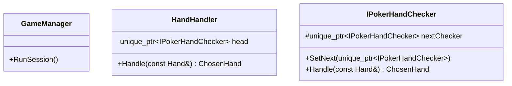
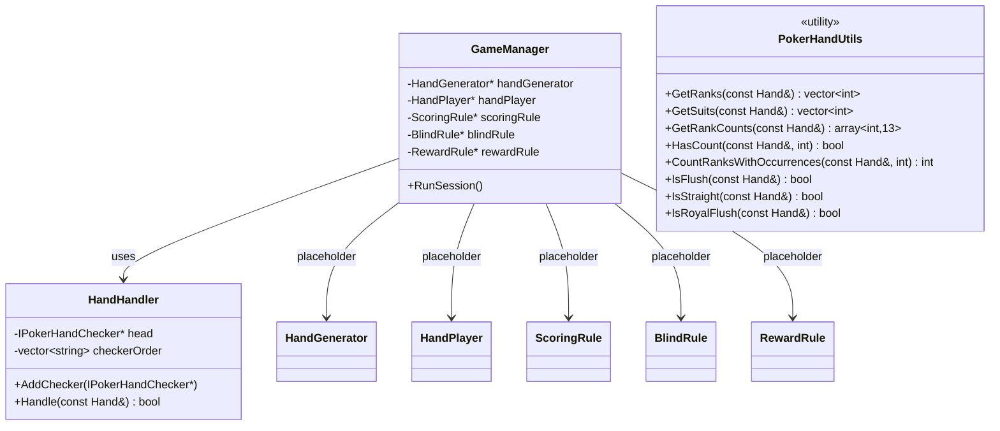

# Analisis Design Pattern

Dokumen ini merangkum design pattern yang benar-benar terlihat di source code repo ini, beserta class diagram utamanya.

## Ringkasan

### 1. Chain of Responsibility

Pattern utama yang terimplementasi adalah **Chain of Responsibility**.

- `IPokerHandChecker` berperan sebagai abstract handler.
- Setiap checker konkret mewarisi `IPokerHandChecker`.
- Method `Handle(const Hand&)` akan mencoba `Check(...)` pada checker saat ini lalu meneruskan ke `nextChecker` jika gagal.
- `HandHandler` membangun dan memegang urutan chain.

Urutan chain saat ini:

1. `FiveOfKindChecker`
2. `RoyalFlushChecker`
3. `StraightFlushChecker`
4. `FourOfKindChecker`
5. `FlushHouseChecker`
6. `FullHouseChecker`
7. `FlushChecker`
8. `StraightChecker`
9. `ThreeOfKindChecker`
10. `TwoPairChecker`
11. `PairChecker`
12. `HighCardChecker`

### 2. Abstract Class / Polymorphism

Repo ini juga memakai abstract base class dan runtime polymorphism sebagai fondasi implementasi checker:

- `IPokerHandChecker` mendefinisikan kontrak `Check(...)`.
- Semua checker override method tersebut untuk aturan poker yang berbeda.

Ini mendukung Chain of Responsibility, tetapi bukan pattern utama yang berdiri sendiri seperti CoR.

### 3. Utility & Static Rule Classes

`PokerHandUtils`, `HandGenerator`, `ScoringRule`, `BlindRule`, dan `RewardRule` diimplementasikan sebagai kumpulan helper stateless (static methods):

- `HandGenerator::generateHand()`: Sekarang merupakan instance method, dikelola oleh `GameManager` sebagai member variable.
- `ScoringRule`, `BlindRule`, `RewardRule`: Statis, menghindari penggunaan raw pointers di `GameManager`.

### 4. Memory Management (RAII)

Aplikasi menggunakan modern C++ (`std::unique_ptr`) untuk manajemen memori otomatis dalam `HandHandler` dan `IPokerHandChecker`. Ini menjamin tidak ada kebocoran memori pada *Chain of Responsibility*.

## Class Diagram

### Diagram Pendukung: Utility dan Placeholder

Checker konkret memakai `PokerHandUtils` sebagai helper evaluasi hand, tetapi dependensi itu tidak digambar satu per satu agar diagram utama tetap ringkas.

## Kesimpulan

Jika repo ini dianalisis secara ketat berdasarkan implementasi source code saat ini:

- pattern yang jelas terimplementasi adalah **Chain of Responsibility**
- abstract class dan polymorphism dipakai sebagai mekanisme pendukung
- rule classes lain masih **placeholder**, belum membentuk pattern aktif seperti Singleton, Strategy, atau Factory
