# Analisis Lengkap Design Pattern

Dokumen ini menjelaskan secara mendalam setiap design pattern yang diimplementasikan di dalam proyek **Poker Hand Evaluator (Balatro Simulator)**. Setiap pattern dilengkapi dengan penjelasan masalah, solusi, kelas yang terlibat, cuplikan kode, serta diagram Mermaid (Class Diagram dan Sequence Diagram).

---

## Daftar Isi
1. [Chain of Responsibility (Evaluasi Kartu)](#1-chain-of-responsibility-evaluasi-kartu)
2. [Observer Pattern (Efek Kartu Joker)](#2-observer-pattern-efek-kartu-joker)
3. [Strategy Pattern (Aturan Fleksibel Game)](#3-strategy-pattern-aturan-fleksibel-game)
4. [Template Method Pattern (Kalkulasi Skor Standar)](#4-template-method-pattern-kalkulasi-skor-standar)
5. [State Pattern (Progresi Blind)](#5-state-pattern-progresi-blind)
6. [Command Pattern (Penundaan Eksekusi Skip Reward)](#6-command-pattern-penundaan-eksekusi-skip-reward)
7. [Singleton Pattern (Pusat GameManager)](#7-singleton-pattern-pusat-gamemanager)

---

## 1. Chain of Responsibility (Evaluasi Kartu)

### A. Deskripsi Teoretis
Chain of Responsibility adalah behavioral design pattern yang memungkinkan Anda meneruskan permintaan (request) sepanjang rantai handler. Saat menerima permintaan, setiap handler memutuskan untuk memproses permintaan tersebut atau meneruskannya ke handler berikutnya di dalam rantai.

### B. Masalah & Solusi (Konteks Proyek)
* **Masalah**: Terdapat 13 jenis tangan poker (poker hand) dari yang paling kuat/langka (*Flush Five*, *Five of a Kind*, dll.) hingga yang terlemah (*High Card*). Jika kita mendeteksi kartu menggunakan rantai `if-else` raksasa, kodenya akan sangat panjang, berantakan, sulit dirawat, dan melanggar *Open/Closed Principle* (sulit menambah jenis kartu baru).
* **Solusi**: Setiap jenis tangan poker dideteksi oleh kelas checker tersendiri yang mewarisi `IPokerHandChecker`. Checker dihubungkan membentuk rantai berdasarkan tingkat kekuatan tangan poker (dari terkuat ke terlemah). Hand yang dievaluasi dilemparkan ke checker pertama; jika tidak cocok, checker tersebut akan otomatis meneruskannya ke checker berikutnya.

### C. Implementasi Kelas
* [IPokerHandChecker](file:///D:/CODE/C++/Kel.DesignPattern/include/poker_evaluation/IPokerHandChecker.h): Kelas dasar abstrak (*abstract handler*) yang menyimpan pointer ke checker berikutnya (`nextChecker`) dan memiliki metode template `Handle()`.
* **Checker Konkret** (di dalam folder [checker](file:///D:/CODE/C++/Kel.DesignPattern/include/poker_evaluation/checker/)):
  * `FlushFiveChecker` → `FiveOfKindChecker` → `RoyalFlushChecker` → `StraightFlushChecker` → `FourOfKindChecker` → `FlushHouseChecker` → `FullHouseChecker` → `FlushChecker` → `StraightChecker` → `ThreeOfKindChecker` → `TwoPairChecker` → `PairChecker` → `HighCardChecker`
* [PokerHandEvaluator](file:///D:/CODE/C++/Kel.DesignPattern/include/poker_evaluation/PokerHandEvaluator.h): Client yang membangun urutan rantai (*chain*) dan memicu proses evaluasi awal.

### D. Diagram Mermaid
#### Class Diagram
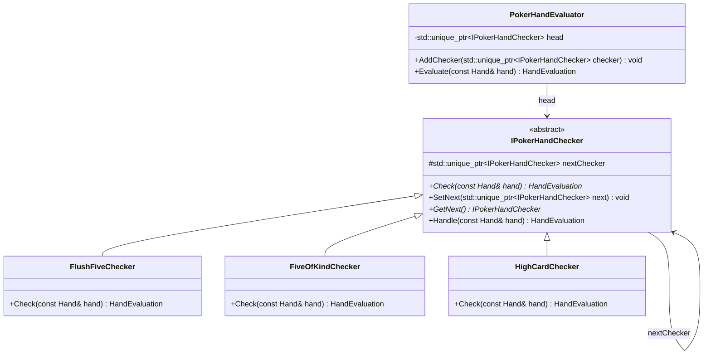

#### Sequence Diagram
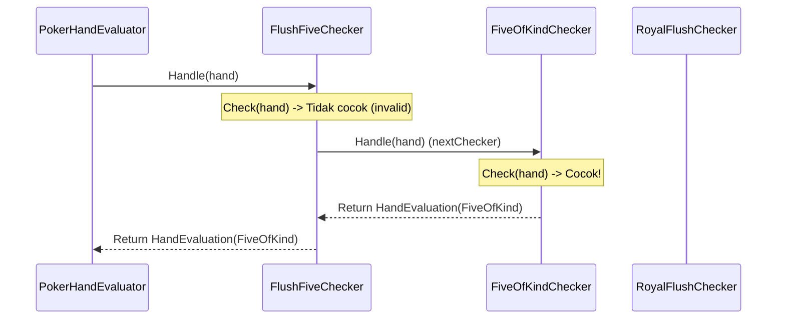

---

## 2. Observer Pattern (Efek Kartu Joker)

### A. Deskripsi Teoretis
Observer adalah behavioral design pattern yang mendefinisikan mekanisme ketergantungan satu-ke-banyak antara objek sehingga ketika satu objek mengubah statusnya, semua objek dependennya diberi tahu dan diperbarui secara otomatis.

### B. Masalah & Solusi (Konteks Proyek)
* **Masalah**: Kartu Joker dapat mengubah nilai chips atau multiplier secara dinamis saat kartu dimainkan. Pemain dapat membeli, menjual, dan menukar posisi kartu Joker. Jika kalkulasi skor dilakukan secara *hardcoded*, kode kalkulator skor akan sangat kompleks dan tidak fleksibel untuk mendukung efek unik dari masing-masing Joker.
* **Solusi**: Setiap kartu Joker dijadikan sebagai `Observer`. Sistem permainan (`JokerManager`) bertindak sebagai `Subject` yang menampung semua observer Joker aktif. Saat tangan poker dinilai, `JokerManager` memicu `NotifyObservers(ScoreContext&)` sehingga semua Joker yang terdaftar dapat memodifikasi nilai `chips` atau `mult` di dalam konteks skor secara berurutan.

### C. Implementasi Kelas
* [Observer](file:///D:/CODE/C++/Kel.DesignPattern/include/joker/Observer.h): Interface abstrak dengan metode virtual `apply(ScoreContext& context)`.
* [Subject](file:///D:/CODE/C++/Kel.DesignPattern/include/joker/Subject.h): Mengelola list `Observer*` dengan fungsi `RegisterObserver`, `RemoveObserver`, dan `NotifyObservers`.
* [JokerCard](file:///D:/CODE/C++/Kel.DesignPattern/include/joker/JokerCard.h): Kelas konkret turunan `Observer` yang menyimpan informasi nama Joker dan mengimplementasikan metode `apply` untuk memodifikasi skor.
* [JokerManager](file:///D:/CODE/C++/Kel.DesignPattern/include/joker/JokerManager.h): Turunan `Subject` berbentuk Singleton yang mengoordinasikan pendaftaran dan notifikasi observer Joker.

### D. Diagram Mermaid
#### Class Diagram
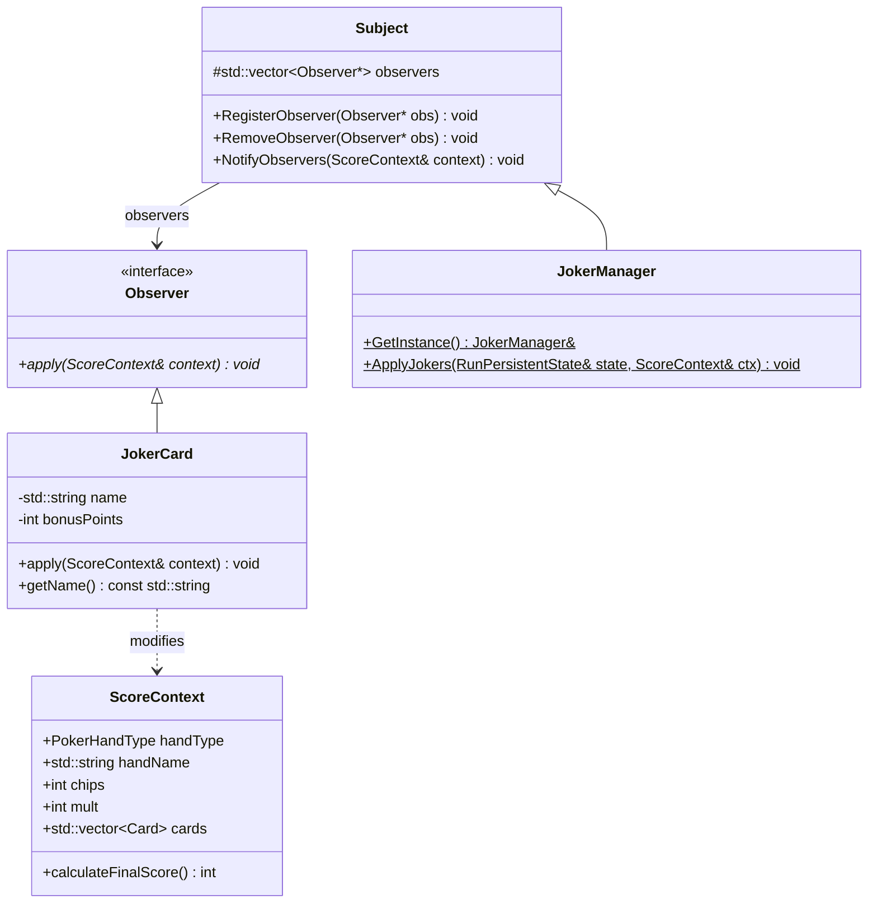

#### Sequence Diagram
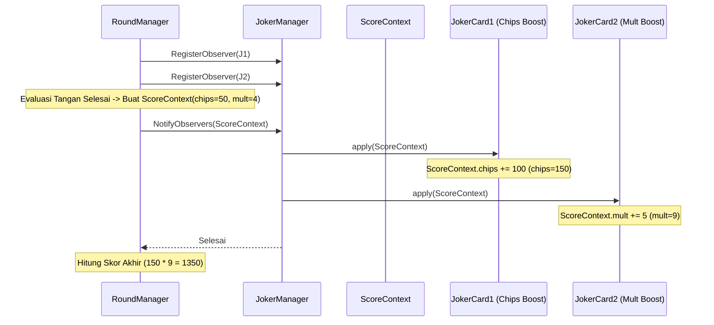

---

## 3. Strategy Pattern (Aturan Fleksibel Game)

### A. Deskripsi Teoretis
Strategy adalah behavioral design pattern yang mendefinisikan sekelompok algoritma, menempatkan masing-masing algoritma ke dalam kelas terpisah, dan membuat objek-objek tersebut saling bertukar (interchangeable) secara dinamis saat runtime.

### B. Masalah & Solusi (Konteks Proyek)
* **Masalah**: Aturan penilaian poker hand, target skor blind, dan kalkulasi hadiah gold dapat berbeda-beda tergantung mode permainan, jenis level blind, atau status kesulitan game. Menyatukan seluruh aturan ini dalam satu kelas besar akan membuat kode sangat kaku.
* **Solusi**: Aturan-aturan ini didelegasikan ke strategi eksternal yang dienkapsulasi ke dalam antarmuka. Dengan memisahkan strategi, kita dapat mengubah aturan game secara dinamis (misal dari strategi `SmallBlind` ke `BossBlind`) hanya dengan mengganti objek strategi di dalam kelas Context.

### C. Implementasi Kelas
Dalam proyek ini, Strategy Pattern digunakan pada 3 modul:
1. **Scoring Strategy**:
   * Context: [ScoringRule](file:///D:/CODE/C++/Kel.DesignPattern/include/scoring/ScoringRule.h)
   * Interface: `IScoringRule`
   * Concrete Strategy: `BaseScoringRule`
2. **Blind Strategy**:
   * Context: [BlindRule](file:///D:/CODE/C++/Kel.DesignPattern/include/blind/BlindRule.h)
   * Interface: `IBlindStrategy`
   * Concrete Strategy: `SmallBlind`, `BigBlind`, `BossBlind`
3. **Reward Strategy**:
   * Context: [RewardRule](file:///D:/CODE/C++/Kel.DesignPattern/include/reward/RewardRule.h)
   * Interface: `IRewardStrategy`
   * Concrete Strategy: `StandardReward`, `GenerousReward`

### D. Diagram Mermaid
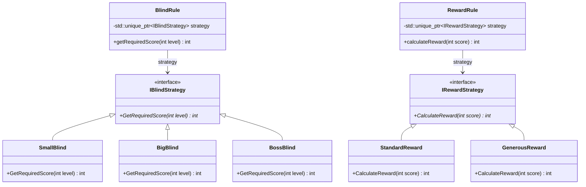

---

## 4. Template Method Pattern (Kalkulasi Skor Standar)

### A. Deskripsi Teoretis
Template Method is a behavioral design pattern yang menetapkan kerangka dasar algoritma dalam superclass tetapi mengizinkan subclass untuk menimpa (override) langkah-langkah spesifik tanpa mengubah struktur keseluruhan algoritma tersebut.

### B. Masalah & Solusi (Konteks Proyek)
* **Masalah**: Alur kalkulasi skor tangan poker selalu melewati tiga langkah tetap:
  1. Deteksi jenis tangan poker (`CheckPokerHand`).
  2. Dapatkan skor dasar/base score (`GetBaseScore`).
  3. Modifikasi skor berdasarkan efek/multiplier tambahan (`ModifyScore`).
  Meskipun langkah 1 dan 2 selalu identik, langkah 3 berbeda-beda tergantung jenis kalkulator skor (misalnya, bonus tambahan untuk tangan tertentu).
* **Solusi**: Kelas basis `ScoreCalculator` mendefinisikan metode template `CalculateScore()`. Metode ini secara ketat memanggil `CheckPokerHand`, `GetBaseScore`, dan memanggil metode virtual murni `ModifyScore` yang bertindak sebagai *hook*. Subclass seperti `StandardScoreCalculator` dan `BonusScoreCalculator` hanya perlu mengimplementasikan metode `ModifyScore`.

### C. Implementasi Kelas
* [ScoreCalculator](file:///D:/CODE/C++/Kel.DesignPattern/include/scoring/ScoreCalculator.h): Kelas basis abstrak yang memegang metode template `CalculateScore()`.
* [ConcreteScoreCalculators.h](file:///D:/CODE/C++/Kel.DesignPattern/include/scoring/ConcreteScoreCalculators.h):
  * `StandardScoreCalculator`: Mengembalikan skor dasar apa adanya tanpa modifikasi tambahan.
  * `BonusScoreCalculator`: Memberikan tambahan bonus flat (+50 untuk Flush/Full House, +150 untuk Royal Flush, dll).

### D. Diagram Mermaid
#### Class Diagram
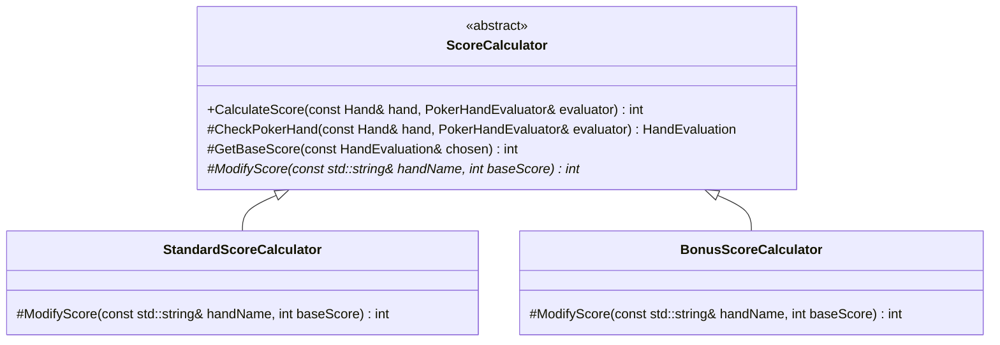

#### Sequence Diagram
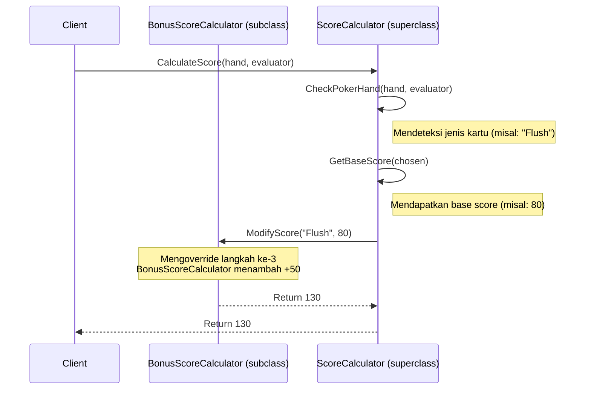

---

## 5. State Pattern (Progresi Blind)

### A. Deskripsi Teoretis
State adalah behavioral design pattern yang memungkinkan suatu objek mengubah perilakunya ketika status internalnya berubah. Objek akan tampak seperti berganti kelas secara dinamis.

### B. Masalah & Solusi (Konteks Proyek)
* **Masalah**: Game memiliki siklus tingkat blind yang berputar terus-menerus: `Small Blind` → `Big Blind` → `Boss Blind`. Setelah mengalahkan `Boss Blind`, tingkat kesulitan (Ante) naik dan siklus kembali ke `Small Blind`. Menulis transisi ini dengan status variabel integer dan `if-else` atau `switch-case` di dalam `GameManager` akan mengotori alur logika game.
* **Solusi**: Bungkus status blind saat ini ke dalam objek `BlindState`. Setiap state konkret mengerti berapa target skor yang dibutuhkan, berapa reward gold yang diberikan, dan apa state selanjutnya. Transisi terjadi secara dinamis dengan memanggil `nextState(int& ante)`.

### C. Implementasi Kelas
* [BlindState](file:///D:/CODE/C++/Kel.DesignPattern/include/blind/BlindState.h): Interface dasar untuk mendefinisikan representasi status blind.
* **State Konkret**:
  * [SmallBlindState](file:///D:/CODE/C++/Kel.DesignPattern/include/blind/SmallBlindState.h): Menghitung skor target `300 * ante`, memberikan reward gold `3`, dan transisi ke `BigBlindState`.
  * [BigBlindState](file:///D:/CODE/C++/Kel.DesignPattern/include/blind/BigBlindState.h): Menghitung skor target `450 * ante`, memberikan reward gold `4`, dan transisi ke `BossBlindState`.
  * [BossBlindState](file:///D:/CODE/C++/Kel.DesignPattern/include/blind/BossBlindState.h): Menghitung skor target `600 * ante`, memberikan reward gold `5`, menaikkan `ante += 1`, dan kembali ke `SmallBlindState`.
* [RuntimeSession](file:///D:/CODE/C++/Kel.DesignPattern/include/session/RuntimeSession.h): Context yang menyimpan referensi ke `BlindState` aktif saat ini.

### D. Diagram Mermaid
#### State Transition Diagram
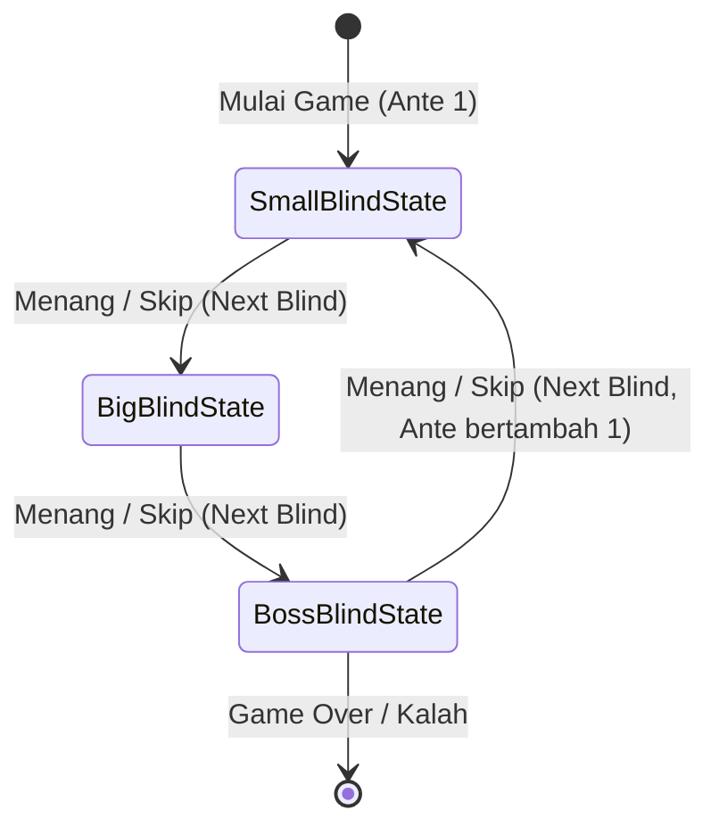

#### Class Diagram
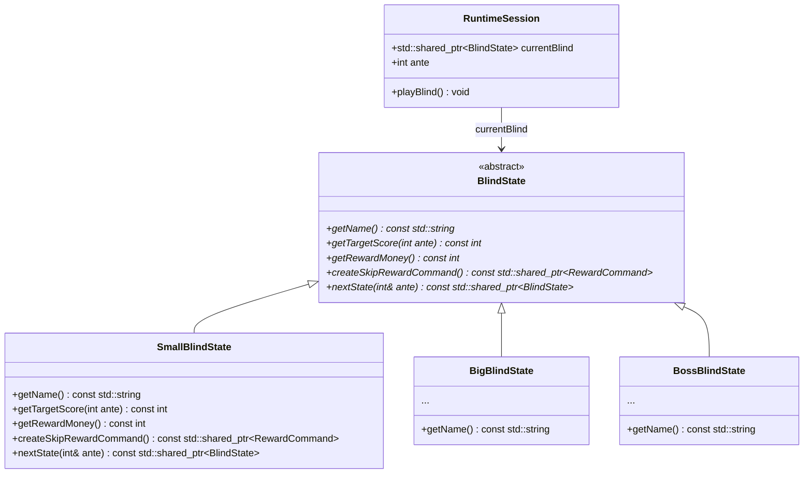

---

## 6. Command Pattern (Penundaan Eksekusi Skip Reward)

### A. Deskripsi Teoretis
Command adalah behavioral design pattern yang mengubah permintaan atau operasi menjadi objek mandiri yang berdiri sendiri. Konversi ini memungkinkan Anda untuk meneruskan permintaan sebagai argumen metode, menunda atau mengantrekan eksekusi permintaan, serta mendukung operasi yang tidak dapat dibatalkan.

### B. Masalah & Solusi (Konteks Proyek)
* **Masalah**: Pemain dapat memilih untuk melakukan "Skip" pada level Blind untuk mendapatkan hadiah penalti instan (*Skip Reward*). Namun, efek reward tersebut tidak boleh langsung aktif di menu. Contohnya: reward *Bonus Hand* (+1 jumlah sisa permainan) hanya boleh dieksekusi di ronde berikutnya (`NextBlind`), sedangkan reward *Free Playing Card* harus ditunda hingga transisi Ante berikutnya (`NextAnte`).
* **Solusi**: Bungkus operasi reward ini menjadi objek `RewardCommand`. Ketika pemain melakukan skip, objek command dimasukkan ke dalam antrean `pendingCommands` di dalam `RuntimeSession`. Saat permainan berpindah ronde (`NextBlind`) atau ante (`NextAnte`), sistem memicu `executePendingCommands(timing)` yang memfilter dan menjalankan command yang cocok, lalu menghapusnya dari antrean.

### C. Implementasi Kelas
* [RewardCommand](file:///D:/CODE/C++/Kel.DesignPattern/include/reward/RewardCommand.h): Interface dasar untuk perintah reward, memiliki metode `execute(RuntimeSession& session)`, `getName()`, dan `getTiming()`.
* **Command Konkret**:
  * [BonusHandCommand](file:///D:/CODE/C++/Kel.DesignPattern/include/reward/BonusHandCommand.h): Memiliki timing `"NextBlind"`. Menambah jumlah `session.remainingPlays` saat dieksekusi.
  * [FreePlayingCardCommand](file:///D:/CODE/C++/Kel.DesignPattern/include/reward/FreePlayingCardCommand.h): Memiliki timing `"NextAnte"`. Menambahkan kartu baru ke deck pemain saat dieksekusi.
* [RuntimeSession](file:///D:/CODE/C++/Kel.DesignPattern/include/session/RuntimeSession.h): Invoker sekaligus Receiver yang menyimpan daftar antrean `pendingCommands` dan memanggil fungsi eksekusinya.

### D. Diagram Mermaid
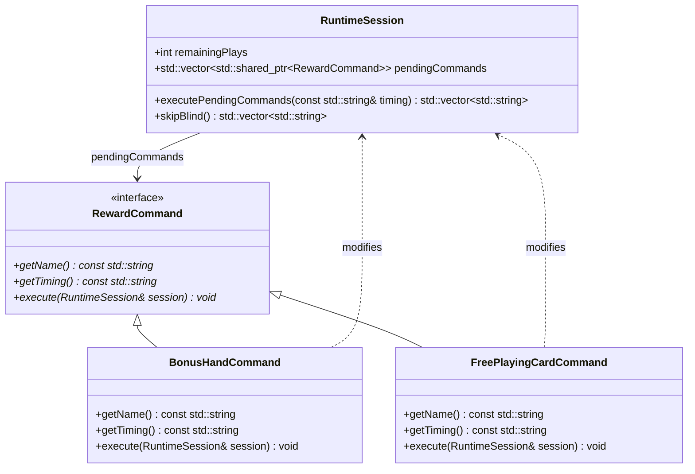

---

## 7. Singleton Pattern (Pusat GameManager)

### A. Deskripsi Teoretis
Singleton adalah creational design pattern yang memastikan suatu kelas hanya memiliki satu instansi (instance) secara global, sekaligus menyediakan titik akses global ke instansi tersebut.

### B. Masalah & Solusi (Konteks Proyek)
* **Masalah**: Sesi permainan membutuhkan satu pusat orkestrasi yang mengelola transisi state game utama (Menu Utama, Pemilihan Blind, Gameplay, Toko/Shop, Game Over) dan memegang siklus hidup dari manajer-manajer subsistem lainnya. Instansi ganda dari kelas pengatur ini akan menyebabkan inkonsistensi status permainan dan kebocoran memori.
* **Solusi**: Kelas `GameManager` dirancang sebagai Singleton dengan menyembunyikan konstruktor (`private constructor`) dan menyediakan metode akses statis global `GetInstance()`.

### C. Implementasi Kelas
* [GameManage.h](file:///D:/CODE/C++/Kel.DesignPattern/include/run/GameManage.h): Mendeklarasikan konstruktor privat, variabel statis instansi `instance`, dan metode statis `GetInstance()`.
* [GameManage.cpp](file:///D:/CODE/C++/Kel.DesignPattern/src/run/GameManage.cpp): Menginisialisasi pointer `instance` ke `nullptr` dan mengimplementasikan mekanisme lazy initialization pada `GetInstance()`.

### D. Diagram Mermaid
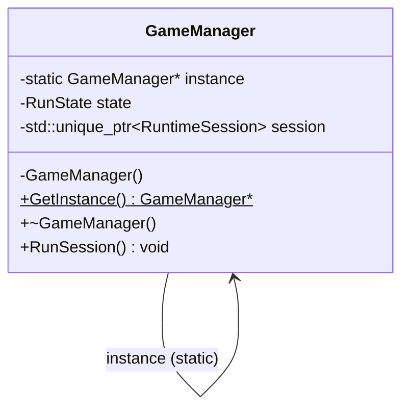
