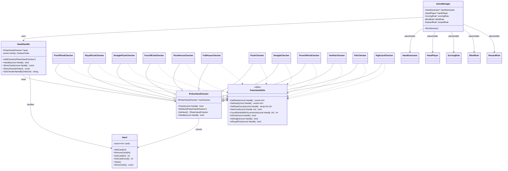

# Analisis Design Pattern

Dokumen ini merangkum design pattern yang benar-benar terlihat di source code repo ini, beserta class diagram utamanya.

## Ringkasan

### 1. Chain of Responsibility

Pattern utama yang terimplementasi adalah **Chain of Responsibility**.

- `IPokerHandChecker` berperan sebagai abstract handler.
- Setiap checker konkret mewarisi `IPokerHandChecker`.
- Method `Handle(const Hand&)` akan mencoba `Check(...)` pada checker saat ini lalu meneruskan ke `nextChecker` jika gagal.
- `HandHandler` membangun dan memegang urutan chain.

Urutan chain saat ini:

1. `FiveOfKindChecker`
2. `RoyalFlushChecker`
3. `StraightFlushChecker`
4. `FourOfKindChecker`
5. `FlushHouseChecker`
6. `FullHouseChecker`
7. `FlushChecker`
8. `StraightChecker`
9. `ThreeOfKindChecker`
10. `TwoPairChecker`
11. `PairChecker`
12. `HighCardChecker`

### 2. Abstract Class / Polymorphism

Repo ini juga memakai abstract base class dan runtime polymorphism sebagai fondasi implementasi checker:

- `IPokerHandChecker` mendefinisikan kontrak `Check(...)`.
- Semua checker override method tersebut untuk aturan poker yang berbeda.

Ini mendukung Chain of Responsibility, tetapi bukan pattern utama yang berdiri sendiri seperti CoR.

### 3. Utility Module

`PokerHandUtils` dipakai sebagai kumpulan helper stateless untuk operasi evaluasi hand:

- `GetRanks`
- `GetSuits`
- `GetRankCounts`
- `HasCount`
- `CountRanksWithOccurrences`
- `IsFlush`
- `IsStraight`
- `IsRoyalFlush`

Pendekatan ini membantu concrete checker tetap tipis dan fokus pada aturan kombinasi yang dicek.

## Pattern Yang Belum Benar-Benar Terimplementasi

### Template Method

Belum tampak sebagai Template Method formal. Memang semua checker memiliki bentuk mirip, tetapi tidak ada base class yang mendefinisikan skeleton algoritma khusus checker selain `Handle(...)` untuk kebutuhan chain.

### Singleton

`GameManager` belum merupakan Singleton:

- constructor tidak privat
- tidak ada `static instance`
- tidak ada accessor seperti `GetInstance()`

Saat ini `GameManager` hanya dibuat langsung di `main.cpp`.

### Strategy / Rule Objects

`ScoringRule`, `BlindRule`, `RewardRule`, `HandGenerator`, dan `HandPlayer` masih berupa placeholder:

- belum memiliki perilaku nyata
- belum dipakai sebagai strategi runtime
- belum ada hierarchy atau implementasi concrete turunan

Karena itu, pattern seperti Strategy atau Factory belum bisa dihitung sebagai implementasi aktif di repo saat ini.

## Class Diagram

Diagram berikut memfokuskan struktur yang benar-benar relevan terhadap pattern utama.

## Kesimpulan

Jika repo ini dianalisis secara ketat berdasarkan implementasi source code saat ini:

- pattern yang jelas terimplementasi adalah **Chain of Responsibility**
- abstract class dan polymorphism dipakai sebagai mekanisme pendukung
- rule classes lain masih **placeholder**, belum membentuk pattern aktif seperti Singleton, Strategy, atau Factory
