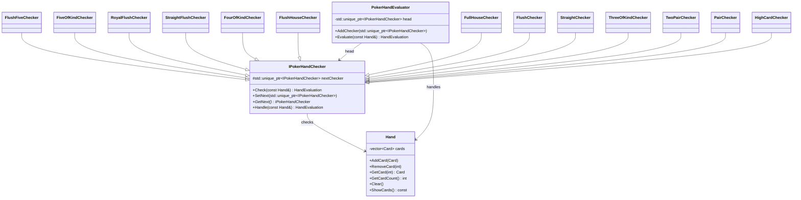
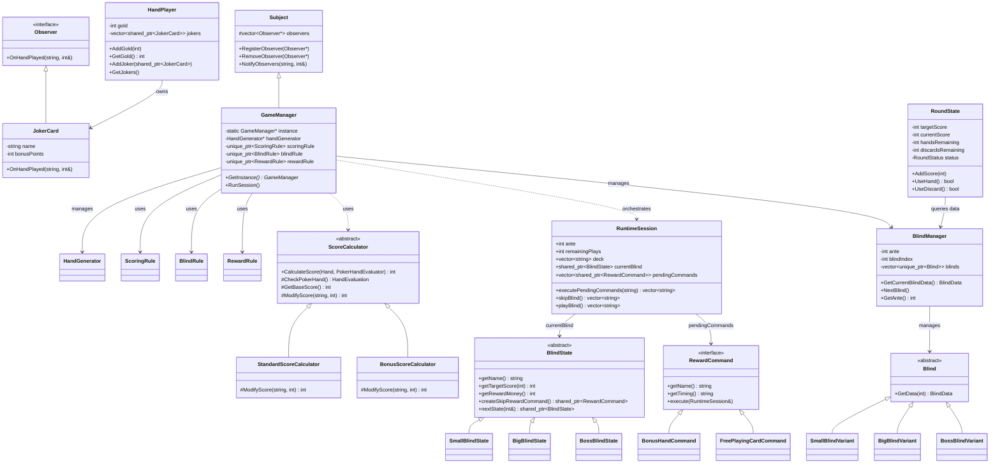

# Analisis Design Pattern

Dokumen ini merangkum design pattern yang benar-benar terlihat di source code repo ini, beserta class diagram utamanya.

## Ringkasan

### 1. Chain of Responsibility

Pattern utama yang terimplementasi adalah **Chain of Responsibility**.

- `IPokerHandChecker` berperan sebagai abstract handler.
- Setiap checker konkret mewarisi `IPokerHandChecker`.
- Method `Handle(const Hand&)` akan mencoba `Check(...)` pada checker saat ini lalu meneruskan ke `nextChecker` jika gagal.
- `PokerHandEvaluator` membangun dan memegang urutan chain.

Urutan chain saat ini:

1. `FlushFiveChecker`
2. `FiveOfKindChecker`
3. `RoyalFlushChecker`
4. `StraightFlushChecker`
5. `FourOfKindChecker`
6. `FlushHouseChecker`
7. `FullHouseChecker`
8. `FlushChecker`
9. `StraightChecker`
10. `ThreeOfKindChecker`
11. `TwoPairChecker`
12. `PairChecker`
13. `HighCardChecker`

### 2. Abstract Class / Polymorphism

Repo ini juga memakai abstract base class dan runtime polymorphism sebagai fondasi implementasi checker:

- `IPokerHandChecker` mendefinisikan kontrak `Check(...)`.
- Semua checker override method tersebut untuk aturan poker yang berbeda.

Ini mendukung Chain of Responsibility, tetapi bukan pattern utama yang berdiri sendiri seperti CoR.

### 3. Strategy Pattern

`ScoringRule`, `BlindRule`, dan `RewardRule` telah direfaktor menggunakan **Strategy Pattern**:
- Masing-masing bertindak sebagai context class yang membungkus antarmuka strategi (`IScoringStrategy`, `IBlindStrategy`, `IRewardStrategy`).
- Strategi konkret seperti `StandardScoring`, `DoubleScoring`, `SmallBlind`, `BigBlind`, `BossBlind`, `StandardReward`, dan `GenerousReward` dapat dipertukarkan secara dinamis.

### 4. Observer Pattern (Joker Cards)

Joker Cards (`JokerCard`) mengamati permainan kartu dan memodifikasi skor akhir secara dinamis:
- `Subject` mengelola daftar pointer `Observer`.
- `GameManager` bertindak sebagai `Subject` yang memanggil `NotifyObservers` ketika kartu selesai dievaluasi.
- `JokerCard` mengimplementasikan antarmuka `Observer` dan menambah poin skor di method `OnHandPlayed`.

### 5. Template Method Pattern

Proses kalkulasi skor distandarisasi lewat **Template Method Pattern**:
- `ScoreCalculator` mendefinisikan langkah algoritma tetap pada method `CalculateScore`: Check Poker Hand → Get Base Score → Modify Score → Return Score.
- Subclass konkret (`StandardScoreCalculator`, `BonusScoreCalculator`) meng-override method hook `ModifyScore` untuk modifikasi skor yang spesifik.

### 6. State Pattern (Blind Progression)

Progresi tingkat blind (Small Blind → Big Blind → Boss Blind → looping kembali ke Small Blind sambil menaikkan Ante) diatur menggunakan **State Pattern**:
- `BlindState` bertindak sebagai abstract state.
- `SmallBlindState`, `BigBlindState`, dan `BossBlindState` mewakili state konkret yang menghitung `targetScore`, `rewardMoney`, serta mengatur transisi ke state berikutnya secara dinamis.

### 7. Command Pattern (Skip Rewards)

Mekanisme skip reward dibungkus dengan **Command Pattern** untuk memfasilitasi eksekusi efek tertunda (deferred execution queue):
- `RewardCommand` bertindak sebagai interface perintah dengan metode `execute(RuntimeSession&)`.
- `BonusHandCommand` dan `FreePlayingCardCommand` adalah perintah konkret dengan timing pemicu (`NextBlind` atau `NextAnte`) yang dieksekusi secara otomatis dari antrean.

### 8. Singleton Pattern

`GameManager` menggunakan **Singleton Pattern** dengan method `GetInstance()` untuk memastikan hanya ada satu manajer game aktif yang mengoordinasikan jalannya sesi.

### 9. Memory Management (RAII)

Aplikasi menggunakan modern C++ (`std::unique_ptr` & `std::shared_ptr`) untuk manajemen memori otomatis dalam `PokerHandEvaluator`, state blind, command queue, dan strategy context di `GameManager`. Ini menjamin tidak ada kebocoran memori.

## Class Diagram

### Diagram Pendukung: Integrasi Arsitektur Baru

Checker konkret memakai `PokerHandUtils` sebagai helper evaluasi hand, tetapi dependensi itu tidak digambar satu per satu agar diagram utama tetap ringkas.

## Kesimpulan

Jika repo ini dianalisis secara ketat berdasarkan implementasi source code saat ini:

- Pattern yang jelas terimplementasi adalah **Chain of Responsibility** (untuk evaluasi jenis kartu poker).
- **Observer Pattern** digunakan untuk efek modifikasi skor secara dinamis oleh Joker Cards.
- **Strategy Pattern** digunakan untuk aturan scoring, blind, dan reward yang modular.
- **Template Method Pattern** digunakan untuk urutan evaluasi dan kalkulasi skor tangan yang terstandarisasi.
- **State Pattern** digunakan untuk perpindahan status tingkat blind secara dinamis tanpa if-else bertumpuk.
- **Command Pattern** digunakan untuk pembungkusan dan eksekusi tertunda (deferred queue) pada skip reward commands.
- **Singleton Pattern** digunakan untuk mengelola daur hidup instance tunggal dari `GameManager`.
- Modern C++ RAII digunakan untuk manajemen memori yang aman (`std::unique_ptr` & `std::shared_ptr`).
