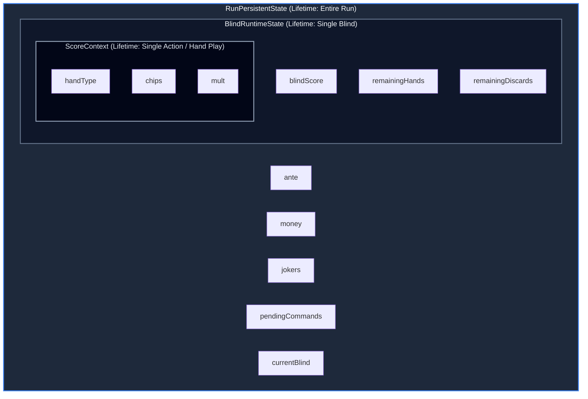

# Runtime State Separation - Architecture & Data Context

Dokumen ini menjelaskan arsitektur pemisahan state berdasarkan **lifetime (masa hidup)** data dalam sistem permainan roguelike poker (Balatro-like). Pendekatan ini memastikan setiap variabel hidup tepat selama yang dibutuhkan, mencegah kebocoran state, dan menegakkan batasan arsitektur (architectural boundaries) yang ketat.

---

## Tiga Layer State

Sistem dibagi menjadi tiga tingkatan state yang saling terisolasi secara struktural:

### 1. Persistent State (`RunPersistentState`)
* **Lifetime**: Dari awal permainan (Run Start) hingga permainan berakhir (Run End/Game Over).
* **Karakteristik**: Menyimpan data progres utama pemain yang tidak boleh direset ketika berpindah blind.
* **Komponen**:
  * `ante` (int): Tingkat kesulitan permainan saat ini.
  * `money` (int): Saldo gold/uang pemain.
  * `jokers` (std::vector): Daftar kartu Joker unik yang dimiliki pemain.
  * `pendingCommands` (std::vector): Antrean perintah reward yang tertunda akibat aksi skip.
  * `currentBlind` (pointer): Status blind aktif saat ini (Small, Big, atau Boss Blind).

### 2. Runtime State (`BlindRuntimeState`)
* **Lifetime**: Hanya bertahan selama satu sesi blind aktif. Dibuat/direset ketika memasuki blind baru dan dibersihkan ketika meninggalkan blind.
* **Karakteristik**: Sangat dinamis selama gameplay berlangsung namun bersifat lokal untuk blind tersebut.
* **Komponen**:
  * `blindScore` (int): Total skor yang berhasil dikumpulkan dalam blind ini untuk mengejar target.
  * `remainingHands` (int): Sisa kesempatan memainkan tangan (Play Hand).
  * `remainingDiscards` (int): Sisa kesempatan membuang kartu (Discard).

### 3. Temporary State (`ScoreContext`)
* **Lifetime**: Hanya bertahan selama satu aksi kalkulasi skor tangan (Play Hand). Dialokasikan di **stack** dan langsung dihancurkan setelah nilai akhir didapatkan.
* **Karakteristik**: Menampung variabel lokal kalkulasi skor yang akan dimodifikasi secara berurutan oleh efek pasif Joker.
* **Komponen**:
  * `handType` (PokerHandType): Tipe kombinasi kartu yang terdeteksi (read-only untuk modifier).
  * `chips` (int): Nilai chips dasar yang kemudian dimodifikasi.
  * `mult` (int): Nilai pengali (multiplier) dasar yang kemudian dimodifikasi.

---

## Pemetaan Data & Hak Akses Mutasi

| Variabel State | Tingkat Layer | Masa Hidup (Lifetime) | Otoritas Mutasi (Hanya Boleh Diubah Oleh) |
|---|---|---|---|
| `ante` | **PERSISTENT** | Sepanjang Run | Sistem Progresi (setelah Boss Blind selesai/skip) |
| `money` | **PERSISTENT** | Sepanjang Run | Toko (Shop) atau Sistem Reward Akhir Blind |
| `jokers` | **PERSISTENT** | Sepanjang Run | Toko (Shop) saat beli/jual Joker |
| `pendingCommands` | **PERSISTENT** | Sepanjang Run | Sistem Skip Blind (menambah) & Trigger Handler (menghapus) |
| `currentBlind` | **PERSISTENT** | Sepanjang Run | Sistem Progresi (transisi blind) |
| `blindScore` | **RUNTIME** | Satu Blind | Sistem Hand Resolution (menambah hasil akhir `finalScore`) |
| `remainingHands` | **RUNTIME** | Satu Blind | Aksi main kartu (berkurang 1 setiap Play Hand) |
| `remainingDiscards` | **RUNTIME** | Satu Blind | Aksi buang kartu (berkurang 1 setiap Discard) |
| `chips` | **TEMPORARY** | Satu Aksi Play | Efek modifier dari kartu Joker aktif |
| `mult` | **TEMPORARY** | Satu Aksi Play | Efek modifier dari kartu Joker aktif |
| `handType` | **TEMPORARY** | Satu Aksi Play | Evaluator Tangan Kartu (Inisialisasi awal, Read-Only) |

---

## Batasan Arsitektur (Architectural Boundary Rules)

Untuk menjamin pemisahan state berjalan dengan benar, batasan-batasan berikut ditegakkan secara struktural di dalam kode:

1. **Joker Terisolasi dari Progression**:
   * Metode `Joker::apply` hanya menerima referensi `ScoreContext&`.
   * Joker **tidak boleh** menerima akses ke `RunPersistentState` maupun `BlindRuntimeState`. Artinya, Joker secara fisik tidak dapat memanipulasi uang pemain (`money`) atau sisa kesempatan (`remainingHands`) saat kalkulasi skor berlangsung.
2. **Kalkulasi Skor Bersifat Lokal**:
   * `ScoreContext` dialokasikan di stack saat kartu dievaluasi.
   * `ScoreContext.finalScore()` (`chips * mult`) dihitung tepat satu kali setelah seluruh modifier Joker diaplikasikan.
   * Setelah skor akhir ditambahkan ke `BlindRuntimeState.blindScore`, objek `ScoreContext` langsung dihancurkan dan tidak meninggalkan referensi atau pointer gantung (dangling pointer).
3. **Pemberian Reward Tertunda (Deferred Reward Execution)**:
   * Command di dalam `pendingCommands` tidak boleh berjalan secara otomatis.
   * Eksekusi hanya dipicu melalui pemanggilan timing eksplisit (misalnya saat transisi `NextBlind` atau `NextAnte`) untuk memastikan efek reward terjadi pada waktu yang tepat.
4. **Pemberian Reward Finansial di Akhir**:
   * `blindScore` tidak boleh ditambahkan langsung ke saldo `money` selama permainan berjalan. 
   * Uang reward dihitung dan ditambahkan ke saldo pemain hanya ketika blind dinyatakan menang (Blind End).

---

## Alur Masa Hidup & Perubahan Data (Data Lifecycle & State Mutation Flow)

Bagian ini memetakan bagaimana data diciptakan, dimutasi, dan dihancurkan seiring dengan progresi permainan.

### 1. Inisialisasi Awal (Run Start)
* **Aksi**: Pemain memulai permainan (Run baru).
* **Mutasi Data**: `RunPersistentState` diciptakan. Nilai awal didefinisikan (`ante` = 1, `money` = 4, `jokers` kosong, `pendingCommands` kosong, `currentBlind` diset ke `SmallBlindState`).
* **Karakteristik**: State ini terus hidup dan melacak status progres global pemain sepanjang keseluruhan permainan.

### 2. Memulai Level Blind (Enter Blind)
* **Aksi**: Pemain masuk ke dalam level blind aktif (misalnya Small Blind).
* **Mutasi Data**: `BlindRuntimeState` diinisialisasi. Variabel lokal diatur ulang (`blindScore` = 0, `remainingHands` = 4, `remainingDiscards` = 4).
* **Karakteristik**: State ini dibuat secara dinamis dan hanya bertahan selama level blind tersebut berjalan.

### 3. Aksi Selama Pertempuran (Gameplay Actions)
* **Aksi A: Play Hand (Memainkan Kartu)**
  1. `ScoreContext` diciptakan sebagai **Temporary State** pada stack.
  2. Jenis tangan dideteksi (misal: "Flush"), kemudian base `chips` dan `mult` diinisialisasi ke dalam `ScoreContext`.
  3. `JokerManager` memicu seluruh Joker aktif yang terdaftar di `RunPersistentState` untuk mengaplikasikan modifikasi skor ke `ScoreContext` (`chips` & `mult` bertambah).
  4. Skor akhir dihitung: `finalScore = chips * mult`.
  5. Nilai `finalScore` ditambahkan ke `BlindRuntimeState.blindScore`.
  6. Kesempatan memainkan kartu berkurang (`remainingHands` dikurangi 1).
  7. Objek `ScoreContext` **dihancurkan** dari stack (masa hidupnya berakhir).
* **Aksi B: Discard (Membuang Kartu)**
  1. Kesempatan membuang kartu berkurang (`remainingDiscards` dikurangi 1).
  2. Tidak ada pembuatan `ScoreContext` karena tidak ada kalkulasi skor.

### 4. Alternatif: Melewati Level (Skip Blind)
* **Aksi**: Pemain memilih untuk melewati Blind saat ini demi mendapatkan Skip Reward.
* **Mutasi Data**:
  1. `currentBlind->createSkipRewardCommand()` dipicu untuk membuat objek reward (misal `BonusHandCommand`).
  2. Objek tersebut dimasukkan ke dalam antrean `pendingCommands` di `RunPersistentState`.
  3. `currentBlind` berganti ke state berikutnya secara otomatis.
  4. `BlindRuntimeState` **tidak pernah diciptakan** untuk level blind ini.

### 5. Akhir Level Blind (Resolve Blind)
* **Aksi**: Menentukan kemenangan atau kekalahan di akhir level blind.
* **Kondisi Menang** (`blindScore >= targetScore`):
  1. Hadiah uang (gold) dihitung berdasarkan `currentBlind->getRewardMoney()`.
  2. Hadiah ditambahkan ke `RunPersistentState.money`.
  3. `RunPersistentState.currentBlind` beralih ke state berikutnya lewat pemanggilan `currentBlind->nextState(ante)`.
  4. Jika state berikutnya beralih melompati Boss Blind, `ante` global bertambah 1.
  5. Perintah tertunda dalam `pendingCommands` yang memiliki timing cocok (`NextBlind` atau `NextAnte`) dieksekusi, lalu dibersihkan dari antrean.
  6. `BlindRuntimeState` saat ini **dihancurkan**.
* **Kondisi Kalah** (`remainingHands == 0` dan `blindScore < targetScore`):
  1. Permainan dinyatakan berakhir (Game Over).
  2. Seluruh state (`RunPersistentState` & `BlindRuntimeState`) dihancurkan.

---

### Diagram Alur Lifetime & Perubahan Data

```mermaid
flowchart TD
    Start([Mulai Run]) --> InitPersistent[Inisialisasi RunPersistentState<br/>Ante=1, Money=4, Jokers=empty, currentBlind=SmallBlind]
    InitPersistent --> ChooseBlind{Pilihan Player}
    
    ChooseBlind -- Play Blind --> InitRuntime[Inisialisasi BlindRuntimeState<br/>blindScore=0, remainingHands=4, remainingDiscards=4]
    
    InitRuntime --> PlayLoop{Kondisi Gameplay}
    
    PlayLoop -- Play Hand --> CreateTemp[Inisialisasi ScoreContext<br/>TEMPORARY STATE]
    CreateTemp --> ApplyJokers[Joker mengamati ScoreContext<br/>Modifier Chips/Mult]
    ApplyJokers --> CalcScore[Hitung finalScore = chips * mult]
    CalcScore --> UpdateRuntime[Tambah finalScore ke blindScore<br/>remainingHands -= 1]
    UpdateRuntime --> DestroyTemp[Hancurkan ScoreContext]
    DestroyTemp --> PlayLoop
    
    PlayLoop -- Discard --> UpdateDiscard[remainingDiscards -= 1]
    UpdateDiscard --> PlayLoop
    
    PlayLoop -- blindScore >= targetScore --> Victory[Menang Blind]
    PlayLoop -- remainingHands == 0 & blindScore < targetScore --> Defeat([Game Over / Kalah])
    
    ChooseBlind -- Skip Blind --> QueueReward[Buat RewardCommand<br/>Masukkan ke pendingCommands]
    QueueReward --> NextStateTransition[Transisi currentBlind.nextState]
    
    Victory --> CalcReward[Hitung Reward Gold]
    CalcReward --> AddMoney[Tambah Gold ke PersistentState.money]
    AddMoney --> NextStateTransition
    
    NextStateTransition --> TriggerCommands[Eksekusi pendingCommands cocok<br/>NextBlind / NextAnte]
    TriggerCommands --> ResetRuntime[Hancurkan BlindRuntimeState]
    ResetRuntime --> ChooseBlind
```

---

## Pemetaan State ke Kode Konkret

Model pembagian layer state dalam dokumen ini diwujudkan secara nyata dalam kode program melalui kelas-kelas berikut:

1. **Persistent State** (`ante`, `money`, `jokers`, `pendingCommands`, `currentBlind`) dikelola oleh kelas [RunPersistentState](file:///D:/CODE/C++/Kel.DesignPattern/include/state/RunPersistentState.h).
2. **Runtime State** (`blindScore`, `remainingHands`, `remainingDiscards`) dikapsulasi di dalam kelas [BlindRuntimeState](file:///D:/CODE/C++/Kel.DesignPattern/include/state/BlindRuntimeState.h).
3. **Temporary State** selama hand play diwakili secara langsung oleh [ScoreContext](file:///D:/CODE/C++/Kel.DesignPattern/include/state/ScoreContext.h) yang dilewatkan ke modifier Joker dan hancur segera setelah scoring selesai.
4. **Composite State Root** mengomposisi keduanya di dalam [RunSessionState](file:///D:/CODE/C++/Kel.DesignPattern/include/state/RunSessionState.h).

