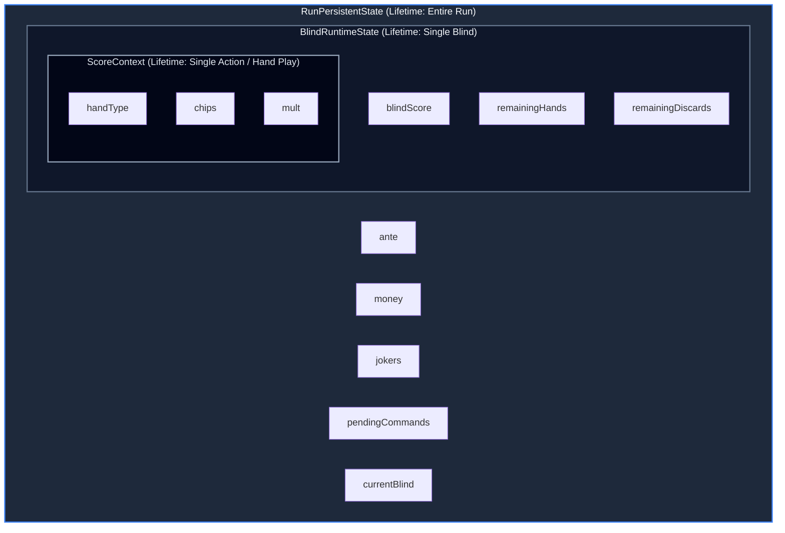

# Runtime State Separation - Architecture & Data Context

Dokumen ini menjelaskan arsitektur pemisahan state berdasarkan **lifetime (masa hidup)** data dalam sistem permainan roguelike poker (Balatro-like). Pendekatan ini memastikan setiap variabel hidup tepat selama yang dibutuhkan, mencegah kebocoran state, dan menegakkan batasan arsitektur (architectural boundaries) yang ketat.

---

## Tiga Layer State

Sistem dibagi menjadi tiga tingkatan state yang saling terisolasi secara struktural:

### 1. Persistent State (`RunPersistentState`)
* **Lifetime**: Dari awal permainan (Run Start) hingga permainan berakhir (Run End/Game Over).
* **Karakteristik**: Menyimpan data progres utama pemain yang tidak boleh direset ketika berpindah blind.
* **Komponen**:
  * `ante` (int): Tingkat kesulitan permainan saat ini.
  * `money` (int): Saldo gold/uang pemain.
  * `jokers` (std::vector): Daftar kartu Joker unik yang dimiliki pemain.
  * `pendingCommands` (std::vector): Antrean perintah reward yang tertunda akibat aksi skip.
  * `currentBlind` (pointer): Status blind aktif saat ini (Small, Big, atau Boss Blind).

### 2. Runtime State (`BlindRuntimeState`)
* **Lifetime**: Hanya bertahan selama satu sesi blind aktif. Dibuat/direset ketika memasuki blind baru dan dibersihkan ketika meninggalkan blind.
* **Karakteristik**: Sangat dinamis selama gameplay berlangsung namun bersifat lokal untuk blind tersebut.
* **Komponen**:
  * `blindScore` (int): Total skor yang berhasil dikumpulkan dalam blind ini untuk mengejar target.
  * `remainingHands` (int): Sisa kesempatan memainkan tangan (Play Hand).
  * `remainingDiscards` (int): Sisa kesempatan membuang kartu (Discard).

### 3. Temporary State (`ScoreContext`)
* **Lifetime**: Hanya bertahan selama satu aksi kalkulasi skor tangan (Play Hand). Dialokasikan di **stack** dan langsung dihancurkan setelah nilai akhir didapatkan.
* **Karakteristik**: Menampung variabel lokal kalkulasi skor yang akan dimodifikasi secara berurutan oleh efek pasif Joker.
* **Komponen**:
  * `handType` (PokerHandType): Tipe kombinasi kartu yang terdeteksi (read-only untuk modifier).
  * `chips` (int): Nilai chips dasar yang kemudian dimodifikasi.
  * `mult` (int): Nilai pengali (multiplier) dasar yang kemudian dimodifikasi.

---

## Pemetaan Data & Hak Akses Mutasi

| Variabel State | Tingkat Layer | Masa Hidup (Lifetime) | Otoritas Mutasi (Hanya Boleh Diubah Oleh) |
|---|---|---|---|
| `ante` | **PERSISTENT** | Sepanjang Run | Sistem Progresi (setelah Boss Blind selesai/skip) |
| `money` | **PERSISTENT** | Sepanjang Run | Toko (Shop) atau Sistem Reward Akhir Blind |
| `jokers` | **PERSISTENT** | Sepanjang Run | Toko (Shop) saat beli/jual Joker |
| `pendingCommands` | **PERSISTENT** | Sepanjang Run | Sistem Skip Blind (menambah) & Trigger Handler (menghapus) |
| `currentBlind` | **PERSISTENT** | Sepanjang Run | Sistem Progresi (transisi blind) |
| `blindScore` | **RUNTIME** | Satu Blind | Sistem Hand Resolution (menambah hasil akhir `finalScore`) |
| `remainingHands` | **RUNTIME** | Satu Blind | Aksi main kartu (berkurang 1 setiap Play Hand) |
| `remainingDiscards` | **RUNTIME** | Satu Blind | Aksi buang kartu (berkurang 1 setiap Discard) |
| `chips` | **TEMPORARY** | Satu Aksi Play | Efek modifier dari kartu Joker aktif |
| `mult` | **TEMPORARY** | Satu Aksi Play | Efek modifier dari kartu Joker aktif |
| `handType` | **TEMPORARY** | Satu Aksi Play | Evaluator Tangan Kartu (Inisialisasi awal, Read-Only) |

---

## Batasan Arsitektur (Architectural Boundary Rules)

Untuk menjamin pemisahan state berjalan dengan benar, batasan-batasan berikut ditegakkan secara struktural di dalam kode:

1. **Joker Terisolasi dari Progression**:
   * Metode `Joker::apply` hanya menerima referensi `ScoreContext&`.
   * Joker **tidak boleh** menerima akses ke `RunPersistentState` maupun `BlindRuntimeState`. Artinya, Joker secara fisik tidak dapat memanipulasi uang pemain (`money`) atau sisa kesempatan (`remainingHands`) saat kalkulasi skor berlangsung.
2. **Kalkulasi Skor Bersifat Lokal**:
   * `ScoreContext` dialokasikan di stack saat kartu dievaluasi.
   * `ScoreContext.finalScore()` (`chips * mult`) dihitung tepat satu kali setelah seluruh modifier Joker diaplikasikan.
   * Setelah skor akhir ditambahkan ke `BlindRuntimeState.blindScore`, objek `ScoreContext` langsung dihancurkan dan tidak meninggalkan referensi atau pointer gantung (dangling pointer).
3. **Pemberian Reward Tertunda (Deferred Reward Execution)**:
   * Command di dalam `pendingCommands` tidak boleh berjalan secara otomatis.
   * Eksekusi hanya dipicu melalui pemanggilan timing eksplisit (misalnya saat transisi `NextBlind` atau `NextAnte`) untuk memastikan efek reward terjadi pada waktu yang tepat.
4. **Pemberian Reward Finansial di Akhir**:
   * `blindScore` tidak boleh ditambahkan langsung ke saldo `money` selama permainan berjalan. 
   * Uang reward dihitung dan ditambahkan ke saldo pemain hanya ketika blind dinyatakan menang (Blind End).

---

## Pemetaan State ke Kode Konkret

Model pembagian layer state dalam dokumen ini diwujudkan secara nyata dalam kode program melalui kelas-kelas berikut:

1. **Persistent State** (`ante`, `blindIndex`) dikelola oleh kelas `BlindManager` di [BlindManager.h](file:///D:/CODE/C++/Kel.DesignPattern/include/blind/BlindManager.h).
2. **Runtime State** (`currentScore`, `handsRemaining`, `discardsRemaining`, `status`) dikapsulasi di dalam kelas `RoundState` di [BlindManager.h](file:///D:/CODE/C++/Kel.DesignPattern/include/blind/BlindManager.h).
3. **Temporary State** during hand play diwakili secara tidak langsung saat pemanggilan `ScoreCalculator` menggunakan kembalian evaluasi `HandEvaluation` dari [PokerHandEvaluator.cpp](file:///D:/CODE/C++/Kel.DesignPattern/src/poker_evaluation/PokerHandEvaluator.cpp).
