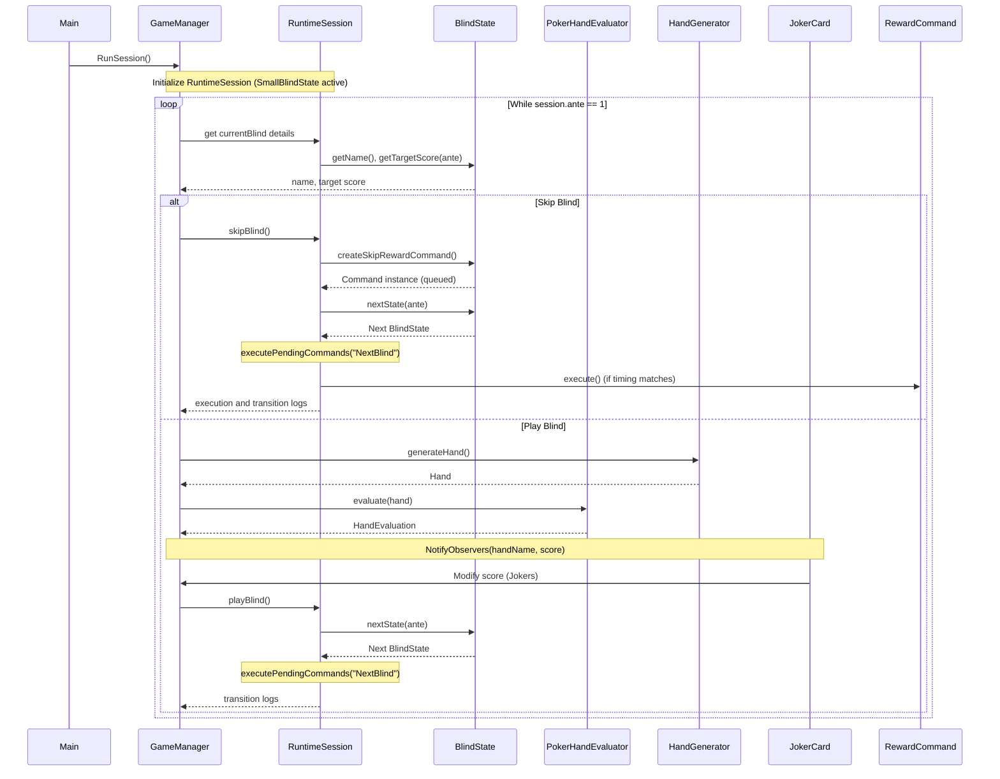

# Sequence Diagram - Poker Hand Evaluator

## Overview
This diagram shows the flow of execution when evaluating a poker hand using the Chain of Responsibility pattern.

## Sequence Diagram

## Execution Flow

1. **Main** → `GameManager::RunSession()`
2. **GameManager** initializes `RuntimeSession` (with `SmallBlindState` active).
3. **Loop** runs while `session.ante` is 1:
   - Gets current blind details (name, target score).
   - User inputs action (`play` or `skip`).
   - If **skip**:
     - `RuntimeSession::skipBlind()` queues the skip reward command from `currentBlind->createSkipRewardCommand()`.
     - State transitions via `currentBlind->nextState(ante)`.
     - `executePendingCommands` runs to trigger matching commands (`NextBlind` or `NextAnte`).
   - If **play**:
     - Hand is generated and evaluated via Chain of Responsibility.
     - Final score calculated (Template Method + Observer modifiers from Joker cards).
     - Gold reward added based on blind reward money.
     - `RuntimeSession::playBlind()` advances blind state.
4. Loop completes when `session.ante` increments.

## Checker Order (Rarest → Commonest)

| Order | Hand | Priority |
|-------|------|----------|
| 1 | Flush Five | Highest |
| 2 | Five of a Kind | |
| 3 | Royal Flush | |
| 4 | Straight Flush | |
| 5 | Four of a Kind | |
| 6 | Flush House | |
| 7 | Full House | |
| 8 | Flush | |
| 9 | Straight | |
| 10 | Three of a Kind | |
| 11 | Two Pair | |
| 12 | Pair | |
| 13 | High Card | Lowest |
