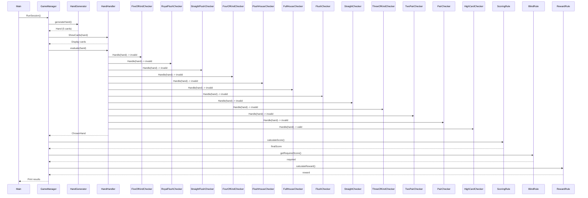

# Sequence Diagram - Poker Hand Evaluator

## Overview
This diagram shows the flow of execution when evaluating a poker hand using the Chain of Responsibility pattern.

## Sequence Diagram

## Execution Flow

1. **Main** → `GameManager::RunSession()`
2. **HandGenerator** generates random 5-card hand
3. **HandHandler** displays cards
4. **Chain of Responsibility** evaluates hand:
   - Checks from rarest (Five of Kind) to commonest (High Card)
   - Each checker returns invalid → passes to next
   - First valid match returns result
5. **Scoring** calculates final score
6. **Blind** gets required score for level
7. **Reward** calculates money earned
8. Results printed to console

## Checker Order (Rarest → Commonest)

| Order | Hand | Priority |
|-------|------|----------|
| 1 | Five of a Kind | Highest |
| 2 | Royal Flush |
| 3 | Straight Flush |
| 4 | Four of a Kind |
| 5 | Flush House |
| 6 | Full House |
| 7 | Flush |
| 8 | Straight |
| 9 | Three of a Kind |
| 10 | Two Pair |
| 11 | Pair |
| 12 | High Card | Lowest |
