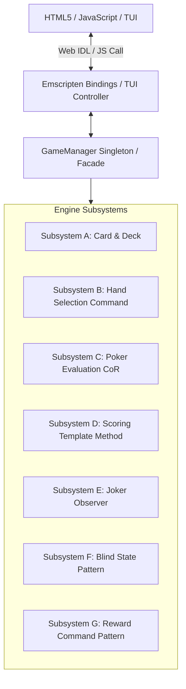
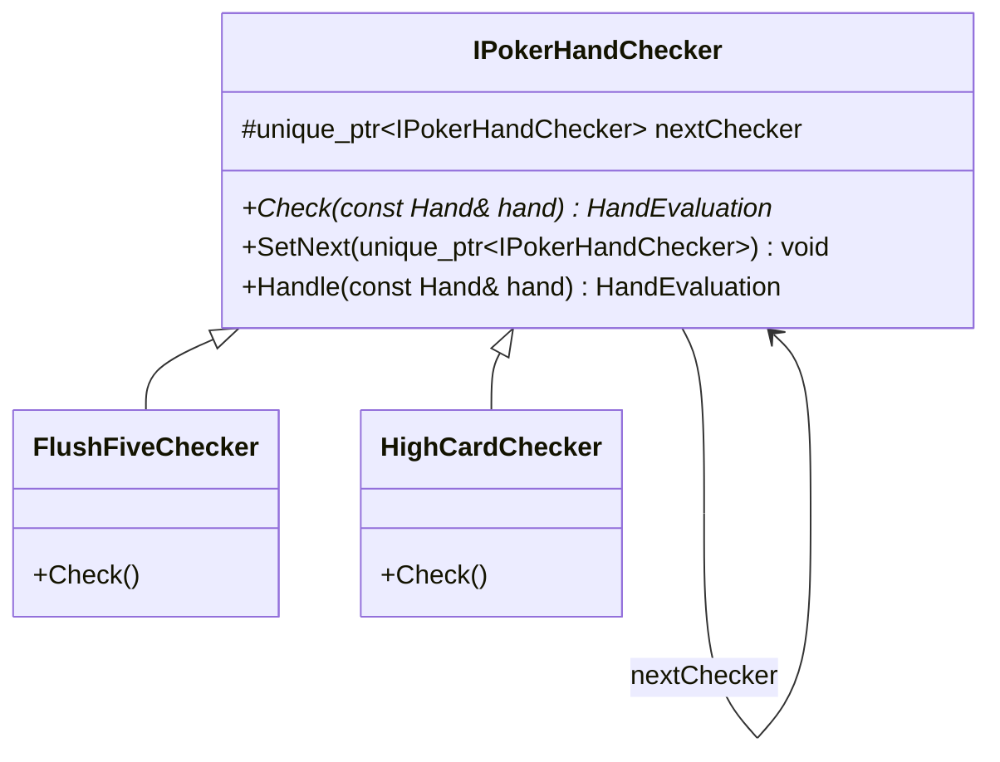
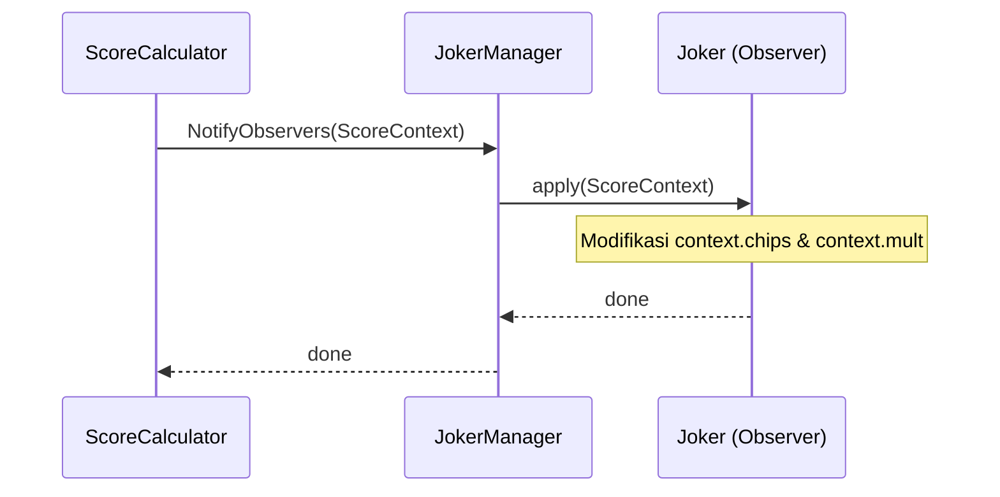

# Technical Design Document (TDD) - Poker Hand Evaluator & Balatro Simulator

Dokumen ini mendefinisikan arsitektur teknis menyeluruh, pola desain, pengelolaan state, integrasi WebAssembly (Wasm), serta strategi pengujian untuk proyek **Poker Hand Evaluator (Balatro Simulator)**.

---

## 1. Overview & System Goals

Sistem ini adalah mesin simulasi mekanik permainan roguelike deck-builder (seperti game *Balatro*) yang ditulis dalam C++17 dan dapat dijalankan baik di CLI/TUI lokal maupun di-compile ke WebAssembly untuk berjalan di web browser.

### Goals
- **Modularitas Tinggi**: Setiap subsystem (card, scoring, jokers, blind, dll.) terisolasi penuh dengan clean include path.
- **Pemisahan Lifetime State**: Mengelompokkan data berdasarkan masa hidupnya (persistent, runtime, temporary) untuk mencegah bug data leak dan mempermudah testing.
- **Ekstabilitas Mudah**: Menambah jenis kartu hand baru, modifier Joker baru, atau rule baru tanpa merusak sistem inti.
- **Portabilitas WebAssembly**: Dapat dieksekusi di browser secara interaktif dengan performa optimal tanpa overhead server-side.

### Non-Goals
- Tidak mensimulasikan seluruh library grafis 3D (rendering murni dilakukan di sisi HTML5/JS frontend via WebAssembly bindings).
- Tidak menggunakan database engine persisten eksternal (menggunakan struktur memori C++ dan serialisasi lokal).

---

## 2. High-Level Architecture

Sistem dibagi menjadi frontend (HTML5/JS/TUI) dan simulator engine (C++17) yang berkomunikasi lewat Emscripten Bindings.

---

## 3. Subsystems & Design Patterns Specification

### Subsystem A: Card & Deck Lifecycle
Mengelola entitas fundamental kartu (`Card`) dan dek (`Deck`). Setiap kartu memiliki ID unik bertipe `std::string` untuk tracking transisi kartu dari dek ke tangan pemain, discard pile, atau list yang dimainkan.
- **Header**: [Card.h](file:///D:/CODE/C++/Kel.DesignPattern/include/card/Card.h)
- **Service**: Menggunakan controller terpisah untuk menarik (`draw`) dan membuang (`discard`) kartu.

### Subsystem B: Hand Selection (Command Pattern with Undo)
Membungkus aksi pemilihan kartu oleh user ke dalam `Command`. Membatasi pemilihan hingga maksimal 5 kartu.
- **Fitur Utama**: Mendukung operasi undo/redo pemilihan kartu agar user bisa membatalkan seleksi sebelum kartu dimainkan.
- **Class Utama**: `SelectCardCommand`, `DeselectCardCommand`.

### Subsystem C: Poker Hand Evaluation (Chain of Responsibility Pattern)
Mengevaluasi kombinasi kartu dari 13 tingkatan prioritas (dari *Flush Five* terkuat hingga *High Card* terlemah).
- **Struktur**: Setiap checker mewarisi `IPokerHandChecker`. Jika checker saat ini tidak mendeteksi kombinasi yang cocok, evaluasi diteruskan ke checker berikutnya (`nextChecker`).
- **Chain Flow**:
  `FlushFiveChecker` → `FiveOfKindChecker` → `RoyalFlushChecker` → `StraightFlushChecker` → `FourOfKindChecker` → `FlushHouseChecker` → `FullHouseChecker` → `FlushChecker` → `StraightChecker` → `ThreeOfKindChecker` → `TwoPairChecker` → `PairChecker` → `HighCardChecker`.

### Subsystem D & E: Scoring & Jokers (Template Method, Observer, & Factory Pattern)
- **Template Method (`ScoreCalculator`)**: Menetapkan kerangka perhitungan skor:
  1. Deteksi hand type (`CheckPokerHand`).
  2. Ambil skor dasar (`GetBaseScore`).
  3. Beri kesempatan observer Joker mengubah skor dasar (`ModifyScore`).
- **Observer (`JokerManager` & `Joker`)**: `JokerManager` bertindak sebagai *Subject*, sedangkan kartu Joker (mewarisi `Joker` abstract interface) bertindak sebagai *Observer*. Saat evaluasi skor, GameManager memanggil `JokerManager::NotifyObservers(ScoreContext&)` untuk memicu fungsi `apply()` pada setiap Joker aktif secara berurutan.
- **Factory Method (`JokerFactory`)**: Mengontrol pembuatan Joker secara dinamis (seperti `ChipsBoostJoker`, `MultBoostJoker`, `FlushMultJoker`, `JokerCard`) untuk shop inventory.

### Subsystem F: Blind Progression (State Pattern)
Mengatur progresi blind permainan tanpa kondisional `if-else` bertumpuk.
- **States**: `SmallBlindState`, `BigBlindState`, `BossBlindState`.
- **Transisi**: Beralih secara otomatis dari `Small` → `Big` → `Boss` → `Small` (sembari meningkatkan Ante level).
- **Class**: `BlindState` (Base), `SmallBlindState`, `BigBlindState`, `BossBlindState`.

### Subsystem G: Skip Tag System (Factory Pattern & Tag Stack)
Ketika pemain memutuskan untuk melompati (skip) level Blind, pemain mendapatkan sebuah **Tag** yang disimpan di dalam stack (`tagStack`).
- **Mekanisme**: Setiap blind memberikan tag berbeda (Small Blind -> Handy Tag, Big Blind -> Economy Tag, Boss Blind -> Orbital Tag). Instansiasi tag dipisahkan menggunakan `TagFactory`.
- **Eksekusi**: Tag serupa yang saling bertumpuk (stack) akan dieksekusi secara bersamaan ketika event pemicunya terjadi (`NEXT_BLIND`, `ENTER_SHOP`, `NEXT_ANTE`). Setelah dieksekusi, tag dihapus dari stack.
- **Class**: `Tag` (Abstract Base), `TagFactory`, `HandyTag`, `EconomyTag`, `OrbitalTag`.

### Subsystem H & I: Runtime State Separation & GameManager (Facade & Singleton)
Memisahkan state game berdasarkan masa hidupnya (lifetime):
1. **Persistent State (`RunPersistentState`)**: Hidup sepanjang seluruh sesi bermain (satu run). Menyimpan `money`, `ante`, list `jokers`, `currentBlind`, `pendingCommands`, dan `tagStack`.
2. **Runtime State (`BlindRuntimeState`)**: Dibuat ulang setiap kali memasuki blind baru. Menyimpan sisa nyawa main (`remainingHands`), sisa discard (`remainingDiscards`), dan perolehan skor sementara (`blindScore`).
3. **Temporary State (`ScoreContext`)**: Dialokasikan murni di **stack** hanya saat satu tangan kartu dievaluasi. Setelah kalkulasi selesai, objek langsung dihancurkan.
4. **Composite State Root (`RunSessionState`)**: Mengelompokkan `RunPersistentState` dan `BlindRuntimeState`.
5. **Facade/Singleton (`GameManager`)**: Satu-satunya interface pusat kontrol game yang membungkus semua fungsionalitas di atas untuk frontend.

---

## 4. WebAssembly & JS Binding Architecture

Proyek ini memanfaatkan compiler Emscripten untuk mengubah kode mesin C++ menjadi file `.wasm` dan `.js` interaktif.

- **Mekanisme Binding**: Menggunakan modul `EMSCRIPTEN_BINDINGS` untuk meregister class dan struct (seperti `Card`, `HandEvaluation`, `ScoreContext`, dan `GameManager`) agar bisa diinstansiasi secara langsung dari JavaScript frontend.
- **Script Build**: [compile_wasm.bat](file:///D:/CODE/C++/Kel.DesignPattern/compile_wasm.bat) / [compile_wasm.sh](file:///D:/CODE/C++/Kel.DesignPattern/compile_wasm.sh) mengompilasi semua file implementasi di `src/` dengan flag optimasi `-O3`, mengaktifkan embinding, dan memproses file output ke direktori `web/`.

---

## 5. Testing Architecture

Pengujian fungsionalitas program menggunakan framework Catch2 di dalam direktori `tests/`.

### Kategori Pengujian
- **Unit Test**: Pengujian class individual secara terisolasi (misalnya `test_card.cpp` untuk manipulasi dek, `test_poker_evaluation.cpp` untuk akurasi CoR).
- **Integration Test**: Menguji skenario runtime lengkap (`test_run_integration.cpp`) untuk memverifikasi GameManager alur game dari start, play, win, next blind, hingga game over.
- **Boundary Test**: Memverifikasi batasan arsitektur state (`test_boundary_enforcement.cpp`), memastikan modifier Joker tidak dapat mengubah state persistent seperti uang atau sisa kesempatan bermain.

---
> [!NOTE]
> Semua penambahan kelas baru wajib didokumentasikan di TDD ini sebelum diimplementasikan ke dalam source code.
